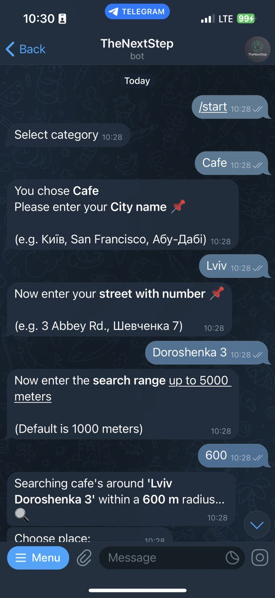
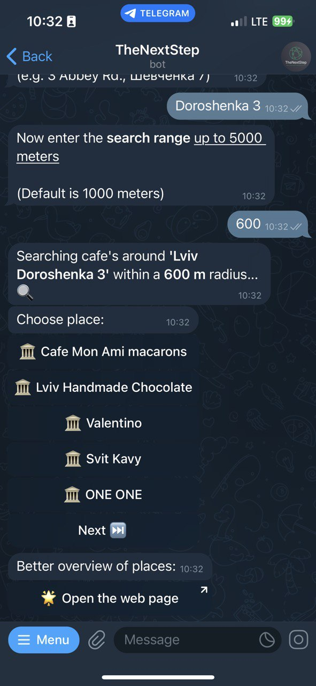
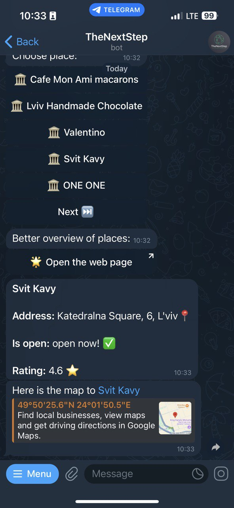
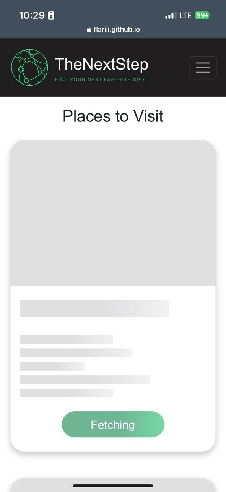
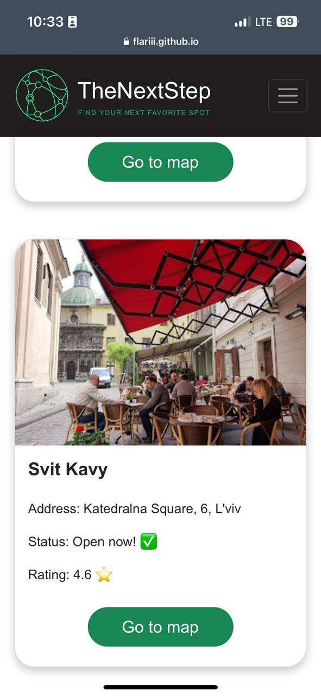
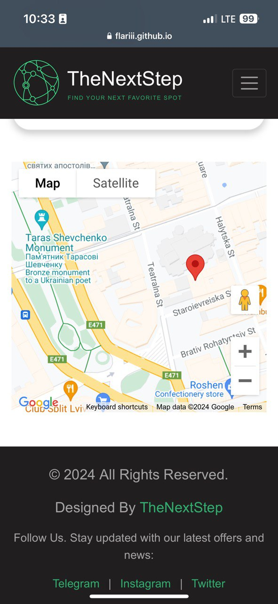
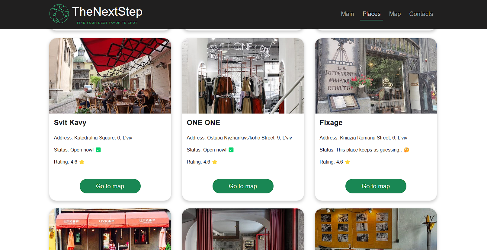
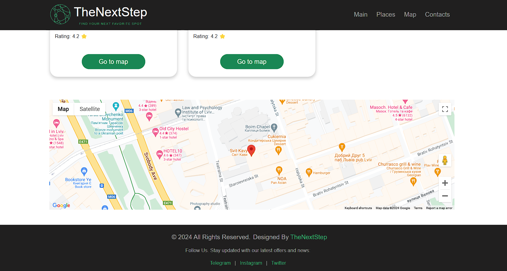

# TheNextStep Bot

A Telegram bot that helps users find the perfect place to spend their time, powered by Google Maps APIs. Users can explore cafes, gyms, parks, or spas near their location. The bot integrates seamlessly with a dark-themed Bootstrap business website, which showcases the functionality visually.

## Features

- **Category Selection**: Choose from Cafes, Gyms (Sports), Parks (Open Spaces), or Spas.
- **Location Input**: Enter your city, street address, and search range (up to 5000 meters).
- **Google APIs Integration**:
  - Geocoding API to convert city and street address into coordinates.
  - Places API to search for nearby locations.
  - Maps API for links to maps with markers.
- **Sorted Results**: Get a list of locations sorted by rating (best to worst).
- **Detailed Place Information**: Select a place to view its description and a link to the map.
- **MongoDB Integration**: Save and organize user search results.
- **Website Integration**: Use the TheNextStep website to explore locations visually.

## Website Features

- Fully responsive design.
- Placeholders for place-cards while fetching data from API
- Google Maps integration for selected places: Navigate to a map with a marker to visually explore the location.

# Example Usage

## interaction with bot
## 1. Start the Bot


## 2. User can select right place in chat OR visit website


## `a) Selecting in Chat`


## `b) Visiting the Website`
## - Mobile View




## - Desktop View



## Usage

> In order to run this bot, you need to install [Node.js](https://nodejs.org/en/). Then, clone this repository and run:

```bash
npm install
```

This will install the required dependencies, including `node-telegram-bot-api`, `telegraf`, `nodemon`, `axios`, `express`, and `mongoose`. To start the bot, run:

```bash
npm run dev
```